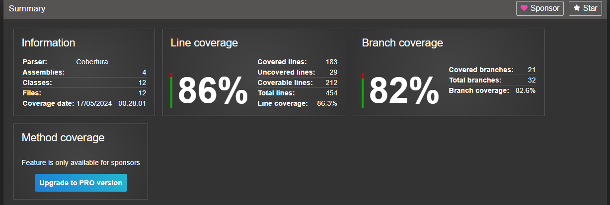

# NuGet FIAP - App Produção

Este repositório contém a implementação do sistema de gestão de produção de predidos, parte do projeto da fase IV do curso de pós-graduação em arquitetura de software da FIAP - 3SOAT. O sistema é estruturado em várias camadas, incluindo acesso a dados, lógica de negócios, e uma API para acesso via aplicativos ou serviços externos.


## Membros:
- [Camila Lemos de Melo - RM 352359]()
- [Christian Soares Santos - RM 351509](https://www.linkedin.com/in/christian-soares-93250a170/)
- [Fábio Guimarães Martins - RM 351825](https://www.linkedin.com/in/fabio-martins-2021)
- [Josué Batista Cruz Júnior - RM 352045](https://www.linkedin.com/in/josuejuniorjf/)


## Tecnologias Utilizadas

- ASP.NET Core: Utilizado para construir a API no servidor, gerenciando as requisições e respostas HTTP.
- Swagger/OpenAPI: Utilizado para documentar a API, permitindo uma visualização interativa e design da API através do Swagger UI.
- Dapper: Um ORM leve para .NET que simplifica o acesso ao banco de dados.
- PostgreSQL: Sistema de gerenciamento de banco de dados relacional.
- Docker: Contêinerização para facilitar o desenvolvimento, teste e produção.
- SpecFlow: Framework para desenvolvimento dirigido por comportamento (BDD), utilizando a linguagem Gherkin para definição de testes.
- XUnit: Framework para testes unitários em .NET.

## Estrutura do Repositório
### Camadas
- nuget-fiap-app-producao-common: Contém modelos e interfaces utilizados pelos serviços e repositórios.
- nuget-fiap-app-producao-repository: Implementação do acesso aos dados utilizando o Dapper.
- nuget-fiap-app-producao-server: API que expõe endpoints para interação com o sistema de produtos.
- nuget-fiap-app-producao-services: Lógica de negócios, chamando os repositórios para acesso a dados.
### Testes
- nuget-fiap-app-producao-test: Testes unitários e de integração.
- nuget-fiap-app-producao-test-bdd: Testes de comportamento usando SpecFlow.

## Docker
O sistema pode ser executado em contêineres Docker, facilitando a configuração e implantação. O arquivo docker-compose.yml raiz configura o ambiente necessário, incluindo a aplicação e o banco de dados.
```bash
docker-compose up -d --build
```
## Testes
Testes são uma parte crucial do projeto, garantindo que todos os componentes funcionem como esperado antes da implantação. O projeto inclui:

- Testes Unitários: Testam componentes individuais para assegurar que executem suas responsabilidades isoladamente.
- Testes de Integração: Verificam a integração entre diferentes módulos e serviços.
- Testes BDD (Behavior-Driven Development): Utilizam cenários escritos em linguagem natural para garantir que o sistema atende aos requisitos de negócios.

### Execução dos Testes
#### Testes Unitários
Para executar apenas os testes unitários na camada server, utilize o seguinte comando:
```bash
dotnet test --filter Category=Unit
```
Este comando seleciona e executa todos os testes marcados com a categoria Unit.
#### Testes de Integração
Para executar os testes de integração:
```bash
dotnet test --filter Category=Integration
```
Antes de rodar os testes de integração, assegure-se de que a base de dados MongoDB esteja configurada corretamente com as variáveis de ambiente DB_PASSWORD, DB_USER, e DB_HOST.
#### Testes BDD
Para os testes de BDD, utilize:
```bash
dotnet test --filter Category=bdd
```
Da mesma forma que os testes de integração, é necessário configurar a base de dados e as variáveis de ambiente mencionadas anteriormente para garantir que os testes de BDD funcionem corretamente.
### Configuração de Ambiente
É importante que a base de dados esteja acessível e configurada corretamente para os testes de integração e BDD. Configure as seguintes variáveis de ambiente antes de executar os testes:

- DB_PASSWORD: Senha do usuário da base de dados.
- DB_USER: Nome do usuário da base de dados.
- DB_HOST: Host onde a base de dados está rodando.

Essas configurações garantem que os testes possam interagir corretamente com a base de dados, permitindo uma avaliação eficaz da integração e comportamento dos componentes do sistema.


### Relatório de Cobertura de Testes

Para visualizar o relatório de cobertura de testes, navegue até o diretório `nuget-fiap-app-producao-test/coveragereport` e abra o arquivo `index.html`. Este relatório fornece uma visão detalhada da cobertura de testes alcançada pelos testes unitários e de integração, ajudando a identificar áreas do código que podem necessitar de mais atenção em termos de testes.




### Geração de Relatório de Cobertura de Testes
Para gerar um relatório detalhado de cobertura de testes, que permite avaliar quais partes do código foram efetivamente testadas, siga os passos abaixo:
#### Executar Testes com Cobertura
Primeiro, execute os testes com a coleta de dados de cobertura ativada usando o seguinte comando:
```bash
dotnet test /p:CollectCoverage=true /p:CoverletOutputFormat=cobertura
```
Este comando habilita a coleta de cobertura durante a execução dos testes e gera um arquivo de cobertura no formato cobertura, um padrão XML para relatórios de cobertura.
#### Gerar Relatório de Cobertura
Após a coleta dos dados de cobertura, utilize o ReportGenerator para converter o arquivo de cobertura em um relatório HTML amigável, facilitando a análise visual dos resultados. Execute o comando abaixo:
```bash
reportgenerator -reports:"coverage.cobertura.xml" -targetdir:"coveragereport" -reporttypes:Html
```
Este comando gera um relatório HTML dentro do diretório coveragereport, utilizando os dados do arquivo coverage.cobertura.xml.
#### Visualizar o Relatório
Para visualizar o relatório de cobertura, navegue até o diretório coveragereport e abra o arquivo index.html em um navegador de sua escolha. Este arquivo apresenta uma visão detalhada da cobertura de teste, incluindo quais linhas de código foram executadas durante os testes.
#### Considerações
Certifique-se de ter o pacote coverlet.collector no seu projeto de teste para a coleta de cobertura funcionar corretamente.
O ReportGenerator deve estar instalado globalmente ou disponível como uma ferramenta em seu ambiente de desenvolvimento para que o comando funcione.


## Consumo da API

Abaixo estão detalhadas as rotas disponíveis na API, juntamente com exemplos de uso para cada operação.


### Categorias

#### Listar Todas as Produções
- Método: GET
- URL: http://<url>/Producao
- Descrição: Retorna todas as produções de pedidos no sistema.

#### Criar Produção
- Método: POST
- URL: http://<url>/Producao
- Body:
```bash
"pedido": {
    "id": "1",
    "cliente": {
      "cpf": "123456",
      "nome": "Eduardo Vargas",
      "email": "string@testes.com.br"
    },
    "itens": [
      {
        "id": 1,
        "descricao": "Hambúrguer",
        "quantidade": 2,
        "preco": 10
      }
    ],
    "data": "2024-05-16T13:23:46.374Z"
  },
```
- Descrição: Adiciona uma nova categoria ao sistema.

#### Obter Produção por ID
- Método: GET
- URL: http://<url>/Producao/1
- Descrição: Retorna os detalhes de uma produção de pedido específica.

#### Atualizar Produção
- Método: PUT
- URL: http://<url>/Producao/5
- Body:
```bash
{
  "id": "5",
  "pedido": {
    "id": "string",
    "cliente": {
      "cpf": "string",
      "nome": "string",
      "email": "string"
    },
    "itens": [
      {
        "id": 0,
        "descricao": "string",
        "quantidade": 0,
        "preco": 0
      }
    ],
    "data": "2024-05-16T23:32:32.317Z"
  },
  "status": 1
}
```
- Descrição: Atualiza os dados de uma produção existente.

#### Excluir Produção
- Método: DELETE
- URL: http://<url>/producao/5
- Descrição: Remove uma produção do sistema.
